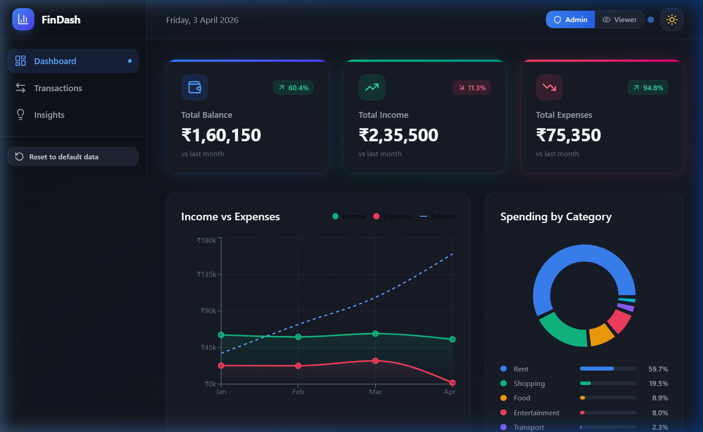
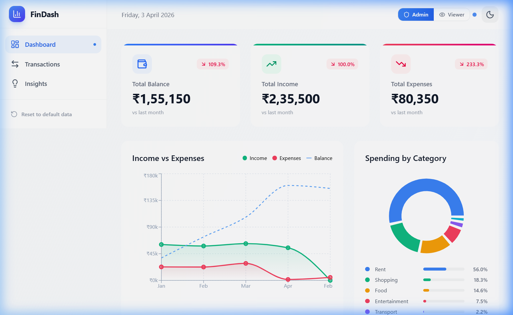
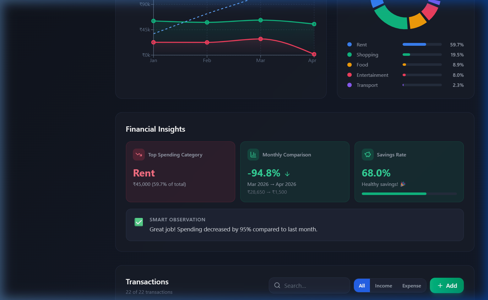
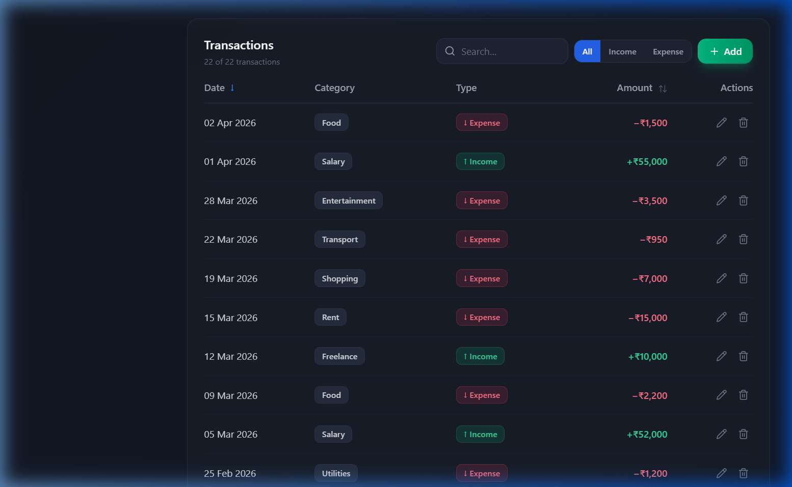
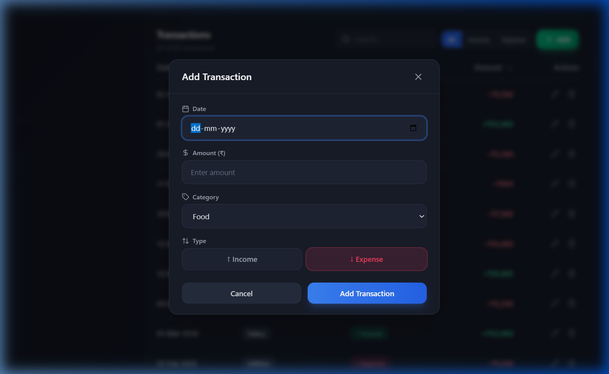
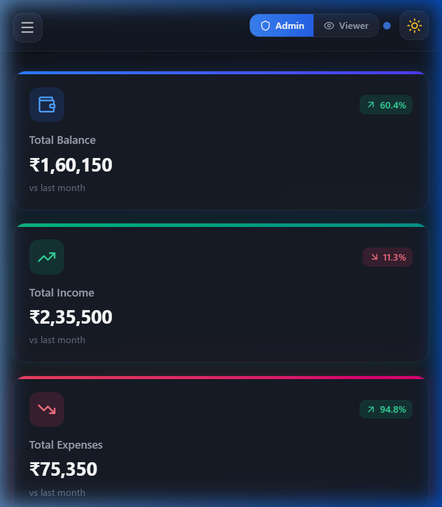

<div align="center">

# 💰 FinDash — Finance Dashboard

### A modern, interactive personal finance dashboard built with React

[](https://react.dev/)
[](https://vite.dev/)
[](https://zustand.docs.pmnd.rs/)
[](https://tailwindcss.com/)
[](https://recharts.org/)

<h3><a href="https://fin-dash-fawn.vercel.app/" target="_blank">🔴 Live Demo</a></h3>

[✨ Features](#-features) · [📸 Screenshots](#-screenshots) · [🚀 Getting Started](#-getting-started) · [🏗️ Architecture](#️-architecture) · [📂 Project Structure](#-project-structure)

</div>

---

## 📸 Screenshots

<div align="center">

### 🌙 Dark Mode


### ☀️ Light Mode


<table>
<tr>
<td width="50%">

### 📊 Financial Insights


</td>
<td width="50%">

### 📋 Transactions Table


</td>
</tr>
<tr>
<td width="50%">

### ➕ Add/Edit Modal


</td>
<td width="50%">

### 📱 Mobile Responsive


</td>
</tr>
</table>

</div>

---

## ✨ Features

### 📊 Dashboard Overview
- **Summary Cards** — Total Balance, Income & Expenses with month-over-month trend indicators (↑/↓ percentages)
- **Area Chart** — Income vs Expenses over time with gradient fills and a dashed cumulative balance line
- **Donut Chart** — Spending breakdown by category with percentage-based progress bar legend

### 💳 Transaction Management
- **Full CRUD** — Add, Edit, and Delete transactions via a polished modal with form validation
- **Real-time Search** — Instantly filter transactions by category, amount, or date
- **Type Filters** — Toggle between All / Income / Expense with color-coded pill buttons
- **Sortable Columns** — Click Date or Amount headers to sort ascending/descending
- **Delete Confirmation** — Inline Confirm/Cancel safeguard prevents accidental deletions
- **Toast Notifications** — Visual feedback for every create, update, and delete action

### 🧠 Financial Insights
- **Top Spending Category** — Identifies the highest expense category with percentage of total
- **Monthly Comparison** — Month-over-month expense change with actual amounts (₹28,650 → ₹1,500)
- **Savings Rate** — Visual progress bar showing income-to-savings ratio
- **Smart Observations** — Contextual advice based on spending patterns

### 🔐 Role-Based Access Control
- **Admin Mode** — Full access: add, edit, delete transactions
- **Viewer Mode** — Read-only: all modification controls are hidden
- **Instant Toggle** — Switch roles via header buttons with animated permission indicator

### 🎨 Design & UX
- **Dark / Light Mode** — Full theme support with smooth transitions, persisted via localStorage
- **Glassmorphism Cards** — Frosted glass effect with subtle backdrop blur
- **Micro-animations** — Hover effects, card lifts, stagger animations, skeleton loading states
- **Gradient Accents** — Color-coded top borders on summary cards (blue/green/rose)
- **Responsive Layout** — Desktop sidebar with collapsible mobile hamburger menu + slide-in drawer

### ⚙️ State Management
- **Zustand Store** — Centralized state with derived selectors (`useFilteredTransactions`, `useTotals`)
- **localStorage Persistence** — Transactions and theme preference survive page refreshes
- **Reset to Defaults** — One-click button to restore the original mock dataset

---

## 🚀 Getting Started

### Prerequisites

- **Node.js** ≥ 18.0
- **npm** ≥ 9.0

### Installation

```bash
# Clone the repository
git clone https://github.com/your-username/finance-dashboard.git
cd finance-dashboard

# Install dependencies
npm install

# Start the development server
npm run dev
```

The app will be available at **http://localhost:5173**

### Available Scripts

| Command | Description |
|---------|-------------|
| `npm run dev` | Start development server with HMR |
| `npm run build` | Build for production |
| `npm run preview` | Preview production build locally |
| `npm run lint` | Run ESLint checks |

---

## 🏗️ Architecture

### Tech Stack

| Layer | Technology | Purpose |
|-------|-----------|---------|
| **UI Framework** | React 19 | Component-based UI |
| **Build Tool** | Vite 8 | Fast HMR & bundling |
| **State Management** | Zustand 5 | Lightweight global state |
| **Styling** | Tailwind CSS 4 | Utility-first CSS |
| **Charts** | Recharts 3 | Declarative data visualization |
| **Icons** | Lucide React | Consistent icon library |
| **Notifications** | React Hot Toast | Toast notification system |

### Design Principles

- **No Borders Rule** — Section boundaries are defined by background shifts (`surface-container-low` vs `surface`), not 1px borders
- **Surface Hierarchy** — Stacked-sheet depth using layered `surface-container` backgrounds
- **Inter Typography** — Consistent font with tight tracking for labels and negative letter-spacing for data points
- **Component Isolation** — Each component manages its own UI state; global state lives in Zustand

### State Flow

```
┌──────────────────────────────────────────────────┐
│                  Zustand Store                    │
│                                                   │
│  transactions[] ──→ useFilteredTransactions()     │
│  role ──────────→ useIsAdmin()                    │
│  darkMode ──────→ Theme Toggle                    │
│  search/filter ─→ Real-time filtering             │
│                                                   │
│  Actions: addTransaction, updateTransaction,      │
│           deleteTransaction, resetData            │
│                                                   │
│  Persistence: localStorage (transactions, theme)  │
└──────────────────────────────────────────────────┘
```

---

## 📂 Project Structure

```
finance-dashboard/
├── public/
├── screenshots/              # README screenshots
├── src/
│   ├── components/
│   │   ├── Charts.jsx        # Area chart + Donut chart (Recharts)
│   │   ├── Header.jsx        # Top bar: date, role switcher, theme toggle
│   │   ├── Insights.jsx      # Financial insights engine
│   │   ├── Modal.jsx         # Reusable animated modal shell
│   │   ├── RoleSwitcher.jsx  # Admin/Viewer toggle with pulse indicator
│   │   ├── Sidebar.jsx       # Navigation sidebar + mobile hamburger
│   │   ├── SummaryCards.jsx  # Balance, Income, Expenses cards
│   │   ├── TransactionModal.jsx  # Add/Edit transaction form
│   │   └── TransactionsTable.jsx # Table with search, filter, sort, CRUD
│   ├── data/
│   │   └── mockData.js       # 22 sample transactions + category icons
│   ├── pages/
│   │   └── Dashboard.jsx     # Main layout: sidebar + header + content
│   ├── store/
│   │   └── useStore.js       # Zustand store + derived hooks
│   ├── utils/
│   │   └── format.js         # Currency, date, short date formatters
│   ├── App.jsx               # Root component + Toast provider
│   ├── main.jsx              # React DOM entry point
│   └── index.css             # Global styles, animations, dark mode
├── index.html
├── package.json
├── vite.config.js
└── README.md
```

---

## 🎯 Key Highlights

<table>
<tr>
<td width="50%">

### ✅ What Makes This Stand Out

- 🏦 **Production-quality UI** — Not a basic MVP
- 📊 **Interactive charts** with gradient fills and custom tooltips
- 🔍 **Real-time search** with count feedback
- 🛡️ **Role-based access** that actually restricts the UI
- 🌓 **Dark/Light mode** with persistent preference
- 📱 **Fully responsive** — desktop sidebar + mobile drawer
- 💾 **Data persists** across sessions via localStorage
- 🎨 **Micro-animations** — hover effects, skeleton loading, stagger

</td>
<td width="50%">

### 🧪 Tested Features

- [x] Summary cards with correct totals
- [x] Trend indicators (month-over-month %)
- [x] Area chart with gradient + balance line
- [x] Donut chart with progress bar legend
- [x] Add transaction via modal
- [x] Edit transaction with pre-filled form
- [x] Delete with inline confirmation
- [x] Search, filter (Income/Expense), sort
- [x] Admin/Viewer role switching
- [x] Dark ↔ Light theme toggle
- [x] Mobile responsive layout
- [x] localStorage persistence + reset
- [x] Toast notifications for all actions
- [x] Zero console errors

</td>
</tr>
</table>

---

## 📄 License

This project is for educational and portfolio purposes.

---

<div align="center">

**Built with ❤️ using React + Zustand + Recharts**

</div>
